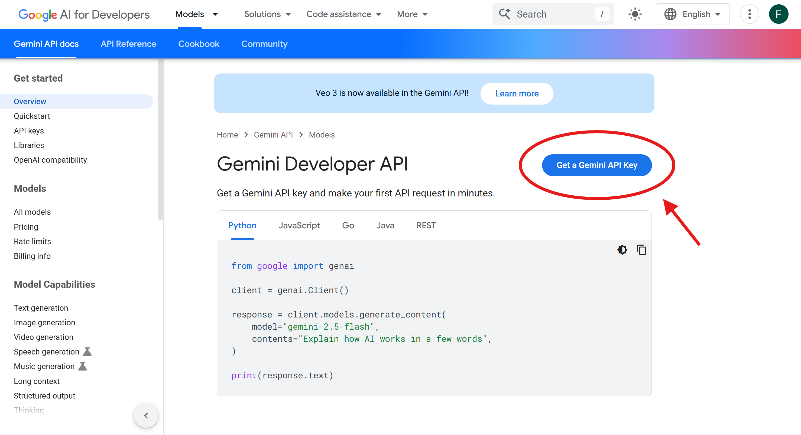
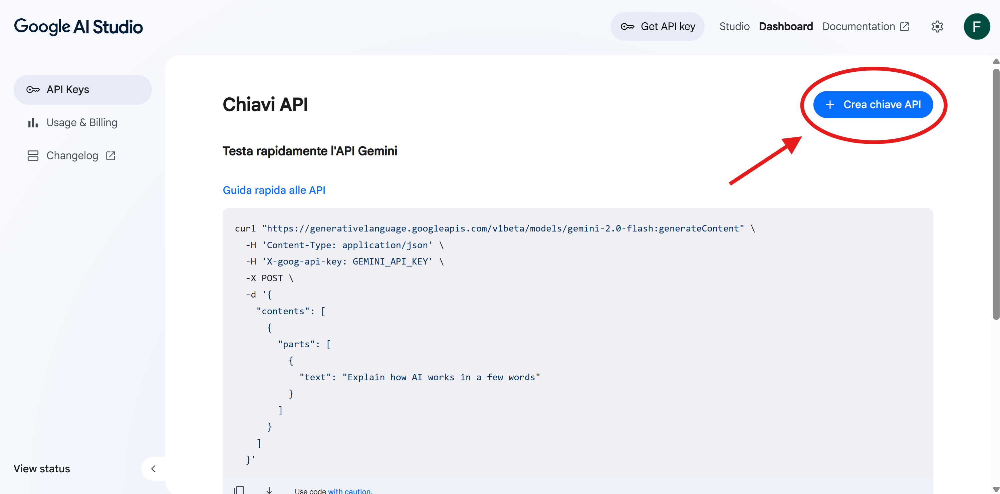

# NAMED ENTITY RECOGNITION - NATURAL LANGUAGE PROCESSING #
Natural Language Processing - 2024/25

## Overview ##
This project implements **Named Entity Recognition (NER)**, a task that detects segments of sentences containing person names, company names, location names, etc., using **zero-shot techniques**. Four different [Google Gemini](https://ai.google.dev/gemini-api/docs) models are evaluated.

This project takes inspiration from the paper [Empirical Study of Zero-Shot NER with ChatGPT by Xie et al. 2023](https://arxiv.org/abs/2310.10035). 

This repository is a template repository for the homeworks to be developed in the [Natural Language Processing](https://stem.elearning.unipd.it/course/view.php?id=9624) course.

*Natural Language Processing* is a course of the [Master Degree in Computer Engineering](https://degrees.dei.unipd.it/master-degrees/computer-engineering/) of the  [Department of Information Engineering](https://www.dei.unipd.it/en/), [University of Padua](https://www.unipd.it/en/), Italy.

## Group members ##
| NAME        | SURNAME     | EMAIL                                     | ID NUMBER  |
|-------------|-------------|-------------------------------------------|------------|
| Francesco   | Chemello    | francesco.chemello.1@studenti.unipd.it    | 2121346    |
| Pietro      | Volpato     | pietro.volpato@studenti.unipd.it          | 2120825    |

## Repository structure ##
The repository is organised as follows:
- **`src/NER.ipynb`:** Main notebook containing the full, updated workflow for zero-shot NER with Gemini and prompt engineering experiments.
- **`development`:** Contains old, experimental, or reference notebooks.
- **`image`:** Images used in this README.

## Datasets Used ##
The English dataset used for the NER task is [CoNLL-2003](https://www.tensorflow.org/datasets/catalog/conll2003), available via **TensorFlow** Datasets. 

It contains English sentences annotated with *Person (PER)*, *Organization (ORG)*, *Location (LOC)*, and *Miscellaneous (MISC)* entities.

## Google Gemini models used
This project uses *four* different Gemini models:
- **`gemini-2.0-flash`:** A highly efficient and versatile model from the Gemini API family.
- **`gemini-2.0-flash-lite`:** A lighter-weight variant of the Gemini Flash model, also accessed via the API.
- **`gemma-3-4b-it`:** A Google-developed model from the Gemma series, specifically identified as a 4 billion parameter version tailored for Italian (indicated by the -it suffix), which is important context as the project evaluates its zero-shot NER performance on English input.
- **`gemma-3-27b-it`:** A larger, more capable Google-developed model from the Gemma series, with 27 billion parameters and similarly focused on Italian language processing.

### How to get a Gemini API key
To get a **free** Gemini API key follow these steps:
1. Go to [Google AI for developer](https://ai.google.dev/gemini-api/docs) and click the blue button **Get a Gemini API key** on the left.

    

    > **Note:** You may have to login to your Google account first.

2. Click the blue button **Create an API key**.

    

**Now you have a Gemini API key!**
> **Note:** For more information about the limit usage, look at this [page](https://ai.google.dev/gemini-api/docs/rate-limits).

## Prompt used
This project uses *four* different prompts with different strategies:
- **`prompt_1` (Baseline Prompt):** This function serves as the baseline, representing the most straightforward zero-shot approach. It provides only the essential NER task instructions and entity definitions, without any additional contextual tips or guidance. The model relies solely on its pre-trained knowledge to perform the task.
- **`prompt_2` (Prompt with Part-of-Speech Tagging):** This new strategy incorporates **Part-of-Speech (POS)** tags into the input prompt to provide the model with explicit syntactic information. Prior to generating the prompt, each input sentence is pre-processed using **spaCy's `en_core_web_sm` model** to obtain the **Penn Treebank POS tag** for each word. The sentence is then formatted as `word/POS_tag` pairs (e.g., `Albert/NNP`, `is/VBZ`), and this augmented input is fed to the LLM. The aim is to investigate whether providing granular syntactic features, traditionally used in rule-based or statistical NER systems, can enhance the LLM's ability to identify named entities in a zero-shot setting.
- **`prompt_3` (Prompt with AI-Generated Tips):** This strategy attempts to enhance model performance by incorporating **automatically generated** "tips" for the NER task. Before processing sentences, an auxiliary `autowrite` function is invoked. This `autowrite` function itself prompts the LLM (the same model being evaluated or a different one) to generate a **list of helpful tips** for performing NER in a zero-shot setting. These AI-generated tips are then dynamically inserted into the main NER prompt, providing the model with potentially beneficial meta-guidance.
- **`prompt_4` (Prompt with Step-by-Step Guide):** This prompt aims to improve performance by providing the model with a detailed, explicit **"step-by-step guide"** on how to perform the NER task. The guide outlines a logical process, from understanding the sentence and tokenization to assigning tags with context, and even includes a self-correction step. This strategy tests whether breaking down the complex NER task into smaller, explicit steps helps the LLM achieve better results in a zero-shot context.

## How to run the code ##
To run the code follow these steps:
1. Open the [`src/NER.ipynb`](src/NER.ipynb) notebook on [Google Colab](https://colab.research.google.com/).
2. Add your **Gemini API key** to the *Secrets* section by clicking the **key icon** on the left of the page. 
    > **Note:** The name **must** be `GOOGLE_API_KEY`.
3. Run all cells in the notebook using **Run All**.
    >**Note:** It might take a while.

## Results ##

A summary of the main results is reported below.  
**Full experimental results** (including all models, prompts, and metrics) are available in [this shared Google Sheet](https://docs.google.com/spreadsheets/d/1cZ0xbIeKydzLzw0u5VHuGuLZPB2Hhj2TBBDGkp7bSPI/edit?usp=sharing).  
> **Note:** Only members of the University of Padua can access it.

### License ###

All the contents of this repository are shared using the [Creative Commons Attribution-ShareAlike 4.0 International License](http://creativecommons.org/licenses/by-sa/4.0/).

